# GIT & GITHUB FAST TRACK

Author: **Muhammad Rizqi Ariadi**

Linkedin: [Muhammad Rizqi Ariadi](https://www.linkedin.com/in/muhammad-rizqi-ariadi-bba168110/)

Facebook: [M Rizqi Ariadi](https://www.facebook.com/Muhammad.Rizqi.Ariadi)

Twitter : [M Rizqi Ariadi](https://twitter.com/MRizqiAriadi)

## Tujuan

Pada DevNotes kali ini, Anda akan mempelajari bagaimana cara membuat Repository pada GitHub dan bagaimana menggunakan git dalam _development apps_. Hasil dari DevNotes kali ini akan seperti ini:

## Tools Yang Dibutuhkan

* [GitHub Dekstop](https://desktop.github.com/) - GitHub Dekstop for Windows/Mac

* [Git](http://git-scm.com) - Git for All Platforms

Git distributions for Linux and POSIX systems are available on
the official Git SCM web site.

## Teori Version Control

Apa itu version control dan mengapa sebaiknya Anda peduli? Version control adalah sebuah sistem yang merekam perubahan-perubahan dari sebuah berkas atau sekumpulan berkas dari waktu ke waktu sehingga Anda dapat menilik kembali versi khusus suatu saat nanti. 

Jika Anda adalah seorang perancang grafis atau web dan ingin menyimpan setiap versi dari sebuah gambar atau layout (yang tentunya Anda ingin melakukannya), sebuah Version Control System (VCS) adalah hal yang bijak untuk digunakan. VCS memperbolehkan Anda untuk mengembalikan berkas-berkas ke keadaan sebelumnya, mengembalikan seluruh proyek kembali ke keadaan sebelumnya, membandingkan perubahan-perubahan di setiap waktu, melihat siapa yang terakhir mengubah sesuatu yang mungkin menimbulkan masalah, siapa dan kapan yang mengenalkan sebuah isu dan banyak lagi. Menggunakan VCS secara umum juga berarti bahwa jika Anda melakukan kesalahan atau menghilangkan berkas, Anda dapat dengan mudah memulihkannya.

### Sistem Version Control Tersebar
Di sinilah Distributed Version Control System (DVCS) masuk. Pada DVCS (seperti Git, Mercurial, Bazaar atau Darcs), para klien tidak hanya melakukan check out pada snapshot terakhir dari berkas: mereka mencerminkan sepenuhnya repository tersebut. Dan juga, jika ada salah satu server yang mati, dan sistem-sistem ini bekerja bersama melalui server itu, setiap repository milik klien dapat disalin kembali ke server untuk memulihkannya. Setiap check out benar-benar cadangan penuh dari semua data.


+ [Referensi](https://git-scm.com/book/id/v2/Memulai-Tentang-Version-Control) - Baca Tentang Version Control Selengkapnya.

## Sejarah GIT

Pada 2005, hubungan antara komunitas yang mengembangkan kernel Linux dan perusahaan komersil yang mengembangkan BitKeeper terputus, dan status bebas biaya dari alatnya dicabut. Hal ini mendesak komunitas pengembangan Linux (khususnya Linus Torvalds, pencipta Linux) untuk mengembangkan alat mereka sendiri berdasarkan beberapa pelajaran yang telah mereka pelajari ketika menggunakan BitKeeper. Beberapa sasaran dari sistem baru tersebut adalah sebagai berikut:

+ Kecepatan
+ Rancangan yang sederhana
+ Dukungan yang kuat untuk pengembangan non-linier (ribuan cabang paralel)
+ Benar-benar tersebar
+ Mampu menangani proyek besar seperti Linux secara efisien (kecepatan dan ukuran data)

Sejak kelahirannya pada 2005, Git telah berevolusi dan berkembang untuk dapat digunakan dengan mudah namun tetap memiliki kualitas awal tersebut. Git sangat cepat, sangat efisien dengan proyek-proyek besar, dan Git memiliki sistem percabangan yang hebat untuk pengembangan non-linear.
+ [Referensi](https://git-scm.com/book/id/v2/Memulai-Sejarah-Singkat-Git) - Baca Sejarah GIT Selengkapnya

## Join GitHub
+ Membuka halaman [Join GitHub](https://github.com/join) → melakukan pendaftaran akun GitHub → melakukan konfirmasi pada email anda.

  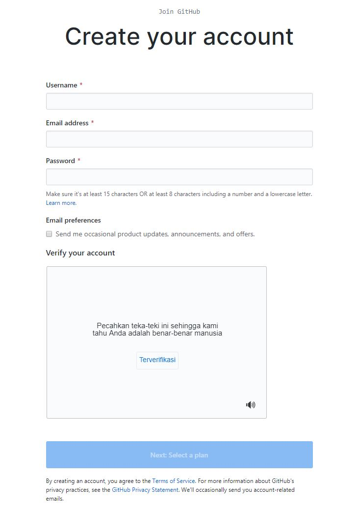

## DevNotes Buat _Repository_ dari GitHub

1. Klik tombol Tambah (__+__) → Memilih menu __new repository__.

    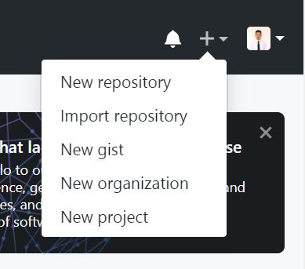

2. Buat *repository* baru di GitHub dengan kriteria sebagai berikut:

    | Perintah | Deskripsi |
    | --- | --- |
    | __Repository name__ | First-Repository |
    | __Description__ | Learning by doing |
    | __Public/Private__ | Public |
    | __Initialize this repository with a README__ | Check |

3. Klik tombol → *Create Repository* , maka akan membuat *repository* seperti ini:

    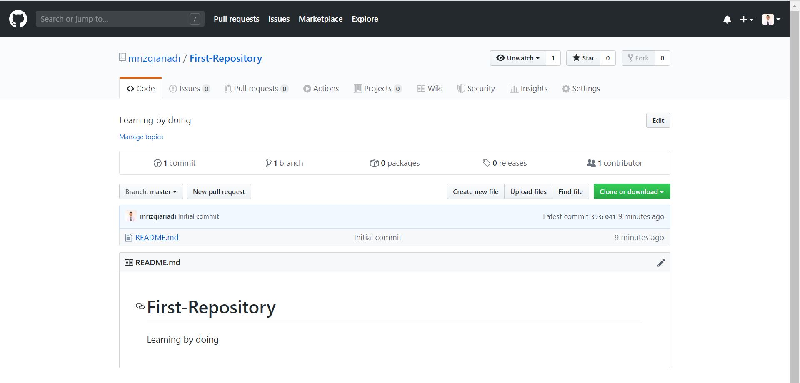
    
   - [x] Selamat anda telah berhasil membuat _repository_ baru :+1:

## DevNotes _Clone Repository_ dari GitHub

Pada materi sebelumnya anda sudah belajar membuat repositori baru. Kita dapat mengambil repositori tersebut dengan melakukan _clone_ dari GitHub ke lokal komputer anda dengan cara sebagai berikut:

1. Klik tombol __Clone or download__ → memilih tombol __copy URL__ / __blok link URL__(Copy).

    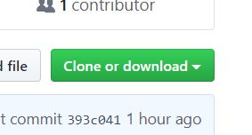
    
    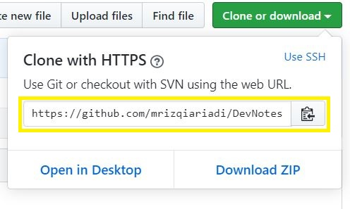
    
2. Buka __Command Prompt (CMD)__ anda, sebelum kita melakukan *clone repository* pastikan anda melihat *folder/directory* __Documents__ dengan menggunakan perintah __dir__ untuk menampilkan isi dari *folder* C:\Users\~username_anda.
`Apabila anda sudah memahami perintah Command Prompt (CMD) silahkan letakkan pada folder/directory yang anda diinginkan.`

    ```CMD
    Microsoft Windows [Version 6.3.9600]
    (c) 2013 Microsoft Corporation. All rights reserved.

    C:\Users\mhmmdrizqi>dir
     Volume in drive C has no label.
     Volume Serial Number is F6DF-BA88

     Directory of C:\Users\mhmmdrizqi

    01/12/2020  08:55 AM    <DIR>          .
    01/12/2020  08:55 AM    <DIR>          ..
    01/12/2020  08:55 AM               215 .gitconfig
    10/08/2019  07:03 PM    <DIR>          .LdVirtualBox
    07/13/2019  08:51 AM               186 .packettracer
    03/17/2019  11:41 PM    <DIR>          .ssh
    01/12/2020  07:37 AM               854 .viminfo
    02/17/2019  06:16 PM    <DIR>          .vscode
    07/13/2019  04:56 AM    <DIR>          Cisco Packet Tracer 7.2.1
    03/17/2019  04:03 PM    <DIR>          Contacts
    01/06/2020  10:18 PM    <DIR>          Desktop
    01/12/2020  08:01 AM    <DIR>          Documents
    01/12/2020  07:04 AM    <DIR>          Downloads
    03/17/2019  04:03 PM    <DIR>          Favorites
    03/17/2019  04:03 PM    <DIR>          Links
    04/06/2019  11:28 AM    <DIR>          Music
    01/12/2020  09:52 AM    <DIR>          Pictures
    03/17/2019  04:03 PM    <DIR>          Saved Games
    04/17/2019  09:36 AM    <DIR>          Searches
    03/17/2019  04:03 PM    <DIR>          Videos
                   3 File(s)          1,255 bytes
                  17 Dir(s)  29,433,196,544 bytes free
    ```

3. Menggunakan perintah __CD__ untuk dapat masuk ke *folder/directory* __Documents__.

    ```CMD
    C:\Users\mhmmdrizqi>CD Documents
    C:\Users\mhmmdrizqi\Documents>
    ```

4. Selanjutnya, lakukan _clone_ dengan perintah __git clone YOUR-URL-REPOSITORY__ sebagai berikut:

    ```CMD
    C:\Users\mhmmdrizqi\Documents>git clone https://github.com/<username>/First-Repository.git
    ```
5. Tunggu sampai proses _download repository_ selesai seperti ini:

     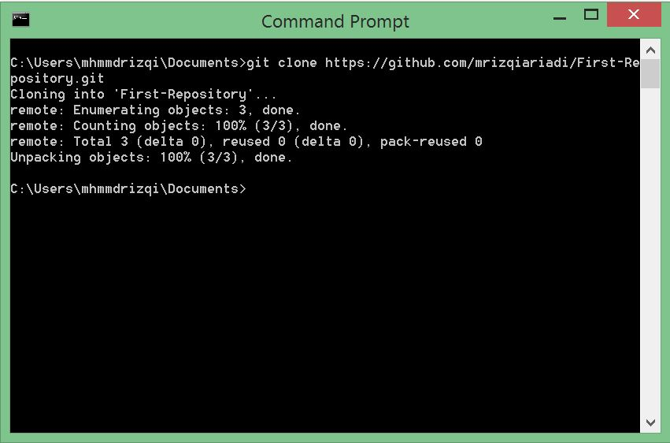
     
6. Selamat anda sudah berhasil melakukan _clone_ dari GitHub ke lokal komputer.

     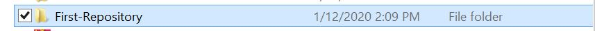
     
     `Penting: ini merupakan salah satu cara untuk melakukan clone repositori anda, ada beberapa cara yang anda dapat gunakan untuk melakukan clone.`
     
   - [x] Selamat anda telah berhasil melakukan _clone repository_ :+1:
   
## DevNotes Menambahkan _file_ ke _Repository_ GitHub

Sekarang kita dapat menambahkan/mengubah/menghapus ___file___ ataupun ___folder___ dari lokal repositori. Jangan khawatir semua jenis file dapat anda tambahkan ke repositori di GitHub. Tentukan beberapa _file_ yang anda ingin tambahkan ke _repository_ anda atau bisa menggunakan contoh _file_ yang kita buat bersama !

### Perintah & Alur Kerja Dasar Git

Ada banyak perintah yang dapat anda lakukan, tetapi kita akan belajar beberapa perintah yang sering digunakan saja. Kemudian alur direktori git hanya sebagai tambahan pemahaman saja, untuk mengetahui letak pada saat anda melakukan beberapa perintah tersebut.

#### Perintah

* Untuk melakukan singkronisasi perubahan ada beberapa perintah yang anda harus ketahui sebagai berikut:

  + __git fetch__

  Unduh semua riwayat dari _remote tracking branchs_ 

  + __git merge__

  Menggabungkan _remote tracking branchs_  ke _branch_ lokal saat ini

  + __git push__

  Unggah semua _commit branch_ lokal ke GitHub

  + __git pull__

  Memperbarui _branch_ tempat kerja lokal Anda saat ini dengan yang baru. Melakukan dari _remote tracking branchs_ yang sesuai di GitHub. (__git pull__ adalah kombinasi dari git fetch dan git merge)

* Untuk melakukan perubahan ada beberapa perintah yang harus anda ketahui sebagai berikut:

  + __git show [commit]__

  Metadata keluaran dan perubahan konten dari _commit_ yang ditentukan.

  + __git add [file]__

  Snapshots file dalam persiapan untuk versi.

  + __git commit -m "[pesan deskriptif]"__

  Merekam snapshot file secara permanen dalam riwayat versi.

#### Alur Kerja Dasar Git

* Alur kerja dasar Git adalah seperti berikut:
   1. Anda mengubah berkas dalam _working directory_ Anda.
   2. Anda menyiapkan berkasnya, menambah snapshot darinya ke _staging area_ Anda.
   3. Anda melakukan _commit_, yang mengambil berkas-berkas yang ada pada _staging area_ dan menyimpan _snapshot_ tersebut secara tetap ke dalam direktori Git Anda.
   
    
    
    

### Buat File Latihan

1. Buat sebuah _file_ bernama __index.html__, letakkan _file_ tersebut. Pada folder __First-Repository__ yang sudah anda clone dari GitHub sebelumnya. Tambahkan dengan kode html berikut:

    ```html
      <!DOCTYPE html>
      <html lang="en">
      <head>
          <meta charset="UTF-8">
          <meta name="viewport" content="width=device-width, initial-scale=1.0">
          <meta http-equiv="X-UA-Compatible" content="ie=edge">
          <title>Latihan GitHub</title>
      </head>
      <body>
          <header>
              Selamat datang di DevNotes
          </header>
          <section class="content">
              Belajar GIT & GitHub
          </section>
          <Footer>
              Terima Kasih
          </Footer>
      </body>
      </html>
    ``` 
Selanjutnya pastikan file sudah diletakkan pada folder __First-Repository__.

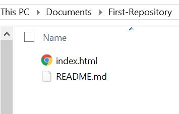

2. Buka __Command Prompt (CMD)__ anda, pindah folder ke __First-Repository__ dengan perintah sebagai berikut:

    ```
      cd Documents\First-Repository
    ```

selanjutnya, setting email dan nama pengguna secara global dengan perintah sebagai berikut:
   
      git config --global user.email you@email.com
      git config --global user.name yourname 
    
3. Setelah anda berpindah folder dan set email dan nama, lakukan perintah untuk memindahkan _file_ tersebut ke _staging area_ dengan perintah sebagai berikut:

    ```
      git add index.html
    ```

`Penting: Anda juga dapat melakukan perintah git add untuk ke semua file/folder yang ditambahkan pada repositori tersebut. Dengan perintah git add . (dot) yang artinya anda menambahkan semua file/folder baru ke staging area. `

4. Kemudian lakukan commit untuk melakukan kompres data menjadi SHA agar dapat di ungguh ke repositori GitHub anda. Dengan perintah sebagai berikut:

    ```
      git commit -m "Add Index"
    ```

5. __Pada saat pertama kali anda melakukan commit akan diminta untuk memasukkan _username_ dan _password_ GitHub anda__. Lakukan unggah ke repositori GitHub anda dengan perintah sebagai berikut:

    ```
      git push -u origin master
    ```

Lakukan check pada repositori First-Repository di GitHub anda.
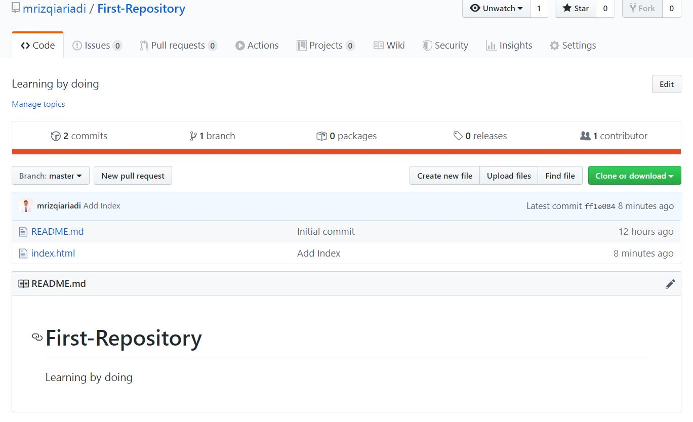

`Penting: Pada saat anda melakukan kolaborasi develop apps bersama teman/rekan anda, pastikan untuk selalu memeriksa perubahan yang dilakukan teman/rekan anda dengan menggunakan perintah git pull atau dapat melihat log dengan perintah git log.`

- [x] Selamat anda telah berhasil melakukan _push_ pertama :+1:

## Mengubah _File / Folder_ pada GitHub

Untuk mengubah kode anda pada saat terjadi kesalahan atau ingin menambah kode dalam _develop apps_. kita dapat lakukan cara yang sama seperti sebelumnya.

1. Kembali buka _project_ / kode anda. kita akan mengubah _file_ index.html sebagai berikut: 

     ```html
      <!DOCTYPE html>
      <html lang="en">
      <head>
          <meta charset="UTF-8">
          <meta name="viewport" content="width=device-width, initial-scale=1.0">
          <meta http-equiv="X-UA-Compatible" content="ie=edge">
          <title>Latihan GitHub</title>
      </head>
      <body>
          <header>
              Selamat datang di DevNotes
          </header>
          <section class="content">
            <p>Merubah isi file github</p>
          </section>
          <Footer>
              Terima Kasih
          </Footer>
      </body>
      </html>
    ```

2. Membuka __Command Prompt (CMD)__ anda. Pindah folder ke Documents\First-Repository menggunakan perintah __CD__ sebagai berikut:

    ```
      CD Documents\First-Repository
    ```
  
3. Kemudian, tambahkan perubahan anda ke _staging area_ dengan perintah sebagai berikut:
  
    ```CMD
      git add .
    ```
  
    `Catatan: . / dot artinya anda menambahkan semua perubahan ke staging area`

4. Setalah menambahkan ke _staging area_. Lakukan commit dengan perintah sebagai berikut:

    ```CMD
      git commit -m "Update Index"
    ```
  
5. Langkah terakhir anda dapat melakukan _push_ ke repositori Github anda, dengan perintah sebagai berikut:
  
    ```CMD
      git push -u origin master
    ```
  
6. Lakukan check log untuk melihat commit yang telah anda lakukan melalui __Command Prompt (CMD)__. kita dapat menggunakan perintah sebagai berikut:

    ```
    git log
    ```
 
   Lakukan check pada repositori anda di GitHub pada file Index.html untuk melihat perubahan tersebut.

   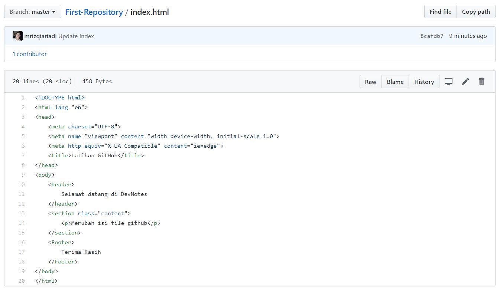

   - [x] Selamat anda telah berhasil melakukan perubahan kode :+1:

## DevNotes Membatalkan Perubahan GIT

Dalam melakukan _Developing Apps_ akan memungkinkan anda melakukan kesalahan atau revisi kode. Untuk dapat dikembalikan ke sebelumnya, fitur git ini cara kerjanya mirip seperti mesin waktu doraemon.

    
 
### Membatalkan Perubahan File yang Sudah dalam Kondisi staged

Pada saat anda sudah melakukan perintah __Git Add__ artinya perubahan _file_ / kode anda telah berada di _staging area_. Tapi dalam kasus ini anda belum melakukan __Commit__.

1. Lakukan perubahan pada _Project_ / kode anda, tambahkan beberapa kode sebagai berikut:

    ```html
          <!DOCTYPE html>
          <html lang="en">
          <head>
              <meta charset="UTF-8">
              <meta name="viewport" content="width=device-width, initial-scale=1.0">
              <meta http-equiv="X-UA-Compatible" content="ie=edge">
              <title>Latihan GitHub</title>
          </head>
          <body>
              <header>
                  Selamat datang di DevNotes
                </br>
                  Lagi Belajar GIT & GitHub Nih !
                </br>
              </header>
              <section class="content">
                <p>Merubah isi file github</p>
              </section>
              <Footer>
                  Terima Kasih
              </Footer>
          </body>
          </html>
    ```

    Kemudian, lakukan __git add__ melalui __Command Prompt (CMD)__ anda, sebagai berikut:
  
    ```
    C:\Users\<yourusername>CD Documents\First-Repository
    C:\Users\<yourusername>git add .
    ```
    
    Periksa _staging area_ dengan perintah __git status__. Perhatikan, apakah terdapat _file_ yang sudah berada di _staging area_?.
    Anda dapat menggunakan perintah sebagai berikut:
    
    ```
    git status
    ```
    Maka hasil status yang akan ditampilkan sebagai berikut:
     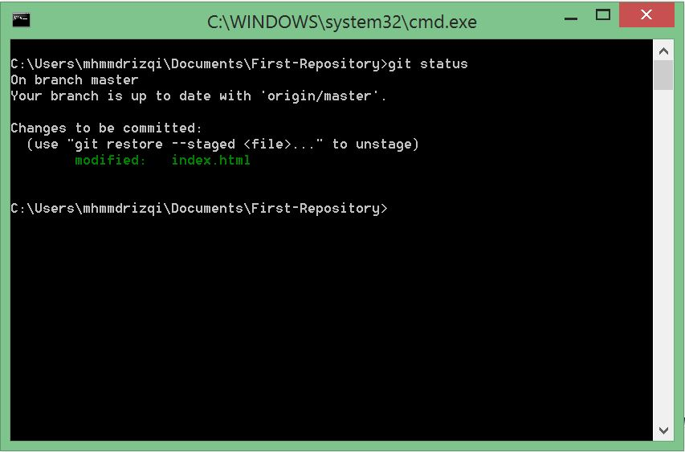
     
2. Kita dapat mengubah statusnya menjadi kondisi _modified_, lakukan perintah seperti berikut:
   
    ```
    git reset index.html
    ```
   
   Kemudian, periksa kembali status file setelah anda lakukan __git reset__, maka hasilnya sebagai berikut:
   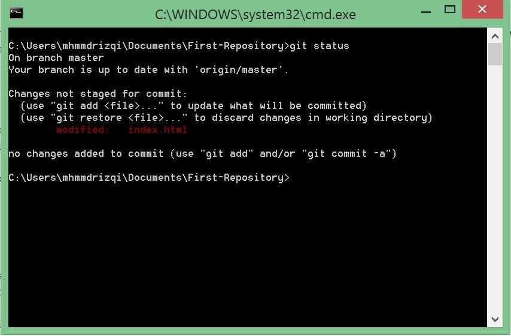
   
3. Selanjutnya anda dapat membatalkan perubahan yang sudah dilakukan sebelumnya. dengan menggunakan perintah sebagai berikut:

    ```
    git checkout index.html
    ```
  
    Lakukan _check_ pada _project_ / kode anda, maka hasilnya akan kembali seperti sebelumnya. Hasilnya sebagai berikut:
    
    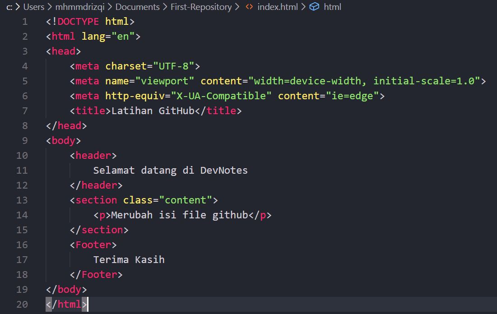

    - [x] Selamat anda telah berhasil melakukan pengembalian perubahan dalam keadaan staged :+1:

### Membatalkan Perubahan _File / Folder_ yang Sudah dalam Kondisi Commited

Selanjutnya, kita akan belajar untuk membatalkan perubahan yang sudah dilakukan __commit__. pada saat anda merasa kode yang dilakukan __commit__ masih ada yang salah.

1. Lakukan perubahan pada _Project_ / kode anda, tambahkan beberapa kode sebagai berikut:

    ```html
          <!DOCTYPE html>
          <html lang="en">
          <head>
              <meta charset="UTF-8">
              <meta name="viewport" content="width=device-width, initial-scale=1.0">
              <meta http-equiv="X-UA-Compatible" content="ie=edge">
              <title>Latihan GitHub</title>
          </head>
          <body>
              <header>
                Selamat datang di DevNotes
                </br>
                  Membatalkan Commit ini
                </br>
              </header>
              <section class="content">
                <p>Merubah isi file github</p>
              </section>
              <Footer>
                  Terima Kasih
              </Footer>
          </body>
          </html>
    ```

    Kemudian, lakukan __git add__ dan __git commit__ melalui __Command Prompt (CMD)__ anda, sebagai berikut:
  
    ```
    C:\Users\<yourusername>CD Documents\First-Repository
    C:\Users\<yourusername>git add .
    C:\Users\<yourusername>git commit -m "Update"
    ```
    
2. Gunakan perintah __git log__ untuk dapat melihat _history commit_ yang telah dilakukan. perhatikan _log_ kedua yang diberi tanda sebagai berikut:

    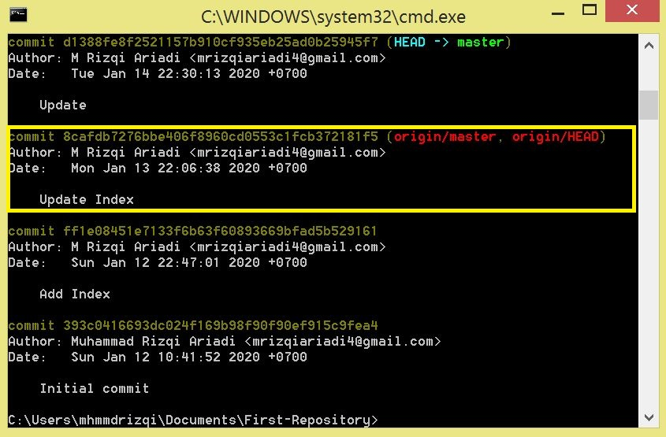
    
3. selanjutnya lakukan __checkout__ dengan 7 digit SHA / id commit anda. Untuk dapat kembali ke _commit_ yang sebelumnya, dengan perintah sebagai berikut:

    ```
      git checkout 8cafdb7 index.html
    ```
    
    Pada saat ini file index.html yang anda kembalikan berada di _staging area_. untuk mengembalikan ke _working area_ anda gunakan perintah sebagai berikut:
    
    ```
    git reset index.html
    ```

    `Penting: Untuk mengembalikan ke commit yang anda inginkan juga dapat menggunakan perintah tersebut, tetapi apabila anda mempunyai    banyak file yang dikembalikan gunakan : git checkout <SHA/ID> tanpa nama file`

    - [x] Selamat anda telah berhasil melakukan pengembalian perubahan dalam keadaan commit :+1:

## DevNotes Membuat _Branch_ pada Git

Sebelumnya kita sudah belajar menambah, merubah dan mengembalikan perubahan pada Git. tapi anda masih menggunakan _Default Branch_ atau _Branch_ utama pada saat pertama kali menggunakan Git dalam melakukan pengembangan aplikasi. Ketika anda melakukan pengembangan aplikasi bersama rekan-rekan dengan menggunakan _Master Branch_. Akan memungkinkan anda terjadi konflik dengan rekan-rekan yang lain karena mengubah _file_ yang sama pada _Master Branch_.

`Solusi: masing-masing rekan anda dalam satu tim membuat branch sendiri-sendiri dengan seperti itu tidak akan menggangu Branch utama / master branch`
  
   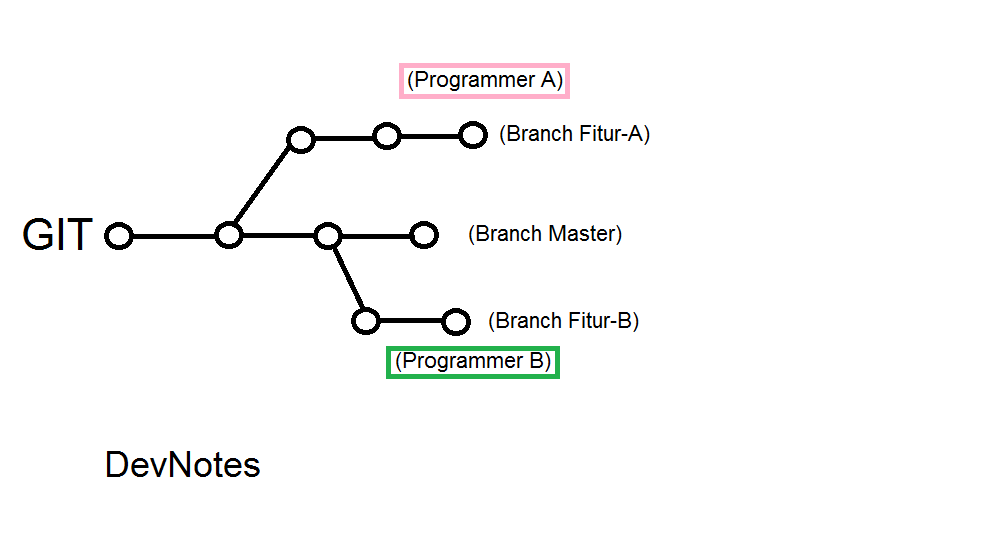
  
1. Buka __Command Prompt (CMD)__ anda, lakukan pembuatan _Branch_ baru bernama __Fitur-A__ dengan cara sebagai berikut:

    ```
      git branch Fitur-A
    ```

    kemudian lihat _Branch_ yang tersedia saat ini dengan perintah __git branch__, maka hasilnya sebagai berikut:
    
    ```
      git branch
    ```
    
   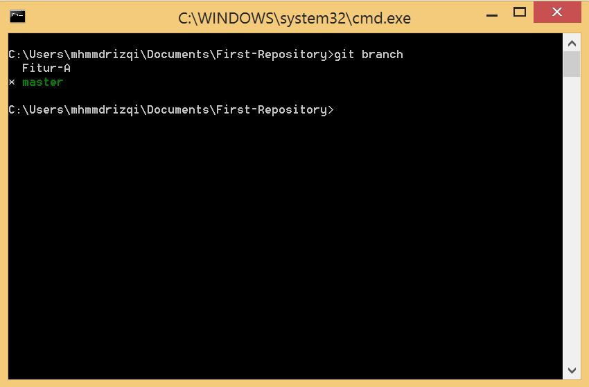
    
   `Catatan: / asteriks artinya branch yang saat ini anda gunakan.`
    
2. Selanjutnya, pindah ke _Fitur-A Branch_ untuk melakukan pengembangan aplikasi anda tanpa menggangu _Master Branch_. Lakukan perintah __git checkout (nama branch)__ sebagai berikut:

    ```
      git  checkout Fitur-A
    ```

    Kemudian lihat kembali saat ini anda sudah berada pada __Fitur-A Branch__, maka hasilnya sebagai berikut:

    ```
      git branch
    ```
    
   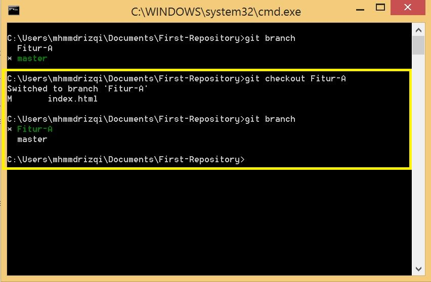
    

## Daftar Kata-kata
* __Git__           : Sistem Kontrol Versi Terdistribusi yang _open source_.
* __GitHub__        : _Platform_ untuk hosting dan berkolaborasi pada repositori GIT.
* __Commit__        : Objek GIT, Snapshot dari seluruh repositori anda yang dikompres menjadi SHA.
* __Branch__        : Pointer yang dapat bergerak menuju ke _Commit_.
* __Clone__         : Versi lokal dari repositori, termasuk semua _Commit_ dan _Branch_.
* __Fork__          : Salinan repositori di GitHub yang dimiliki oleh pengguna lain.
* __Pull Request__  : Tempat untuk membandingkan dan mendiskusikan perbedaan pada sebuah _branch_ dengan ulasan, komentar, terintegrasi tes dan lainnya.
